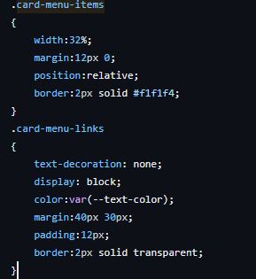
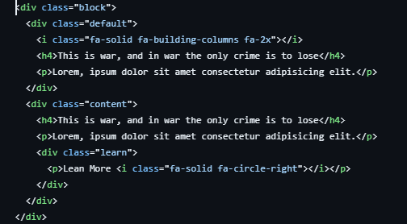

# Review bài tập về nhà buổi 9 - Lớp FullStack K10

## [Phan Tuấn Mạnh](https://github.com/PhanTuanManh/f8-fullstack-k10/blob/master/Day-9)

- [x] **Bài 1:**

`Điểm: 9.25`

- Thành phần `card__image` chưa đúng với đề mẫu. Có thể tìm hiểu thêm về thuộc tính `background-clip` để làm hiệu ứng mầu `trong suốt`.

- [x] **Bài 2:**

`Điểm: 9.5`

- Khi `hover` vào `card` sẽ hiện lên thành phần `card__link`, thẻ `div` có class `arrow` nên để bên trong thẻ `a` vì người dùng có thể bấm vào `arrow` để chuyển hướng trang.

- Các thẻ `img` cần thêm giá trị cho thuộc tính `alt` sẽ hỗ trợ tốt hơn cho `SEO`.

- [x] **Bài 3:**

`Điểm: 10`

- [x] **Điểm mạnh:**
- Sử dụng tốt kiến thức được học và áp dụng vào được bài tập.
- Sử dụng tốt bộ chọn trong `CSS`.
- Sử dụng tốt cách đặt biến trong `CSS`.
- Sử dụng tốt `Keyframes` xây dựng hiệu ứng mượt mà.

- [x] **Điểm yếu:**
- Cần lưu ý hơn về chi tiết đề bài.

- [x] **Đánh giá chung:** Bài làm tốt.

`Điểm tổng kết: 9.6`

`Note: Anh sửa lại bài làm theo phần nhận xét xong và báo lại cho em nhé!`

## [Nguyễn Huy Hoàng](https://github.com/nguyenhoang2404/f8-fullstack-k10/blob/main/BaiTapVeNha9)

- [x] **Bài 1:**

`Điểm: 7`

- `Font Heading` đang dùng là `Inter` trong khi yêu cầu là `Space Grotes`.
- Khi `hover` vào phần tử có class `menu-items` thì thành phần `menu-items-button` không được đổi mầu.
- Chưa thực hiện được hiệu ứng như yêu cầy đề bài là khi `hover` vào `menu-items` thì thành phần bên trái và bên phải sẽ được đổi chỗ cho nhau. Anh nên sử dụng thuộc tính `transform: translateX` và `transition` để hoàn thành yêu cầu đề bài.
- Giao diện chưa đúng với yêu cầu. Phần bên phải trang web không được sử dụng hình ảnh, tìm hiểu thuộc tính `background-clip` để làm hiệu ứng nhìn mầu trong suốt.

- [x] **Bài 2:**

`Điểm: 9.5`

- Các `card-menu-items` chỉ nên bọc thẻ `a` bên ngoài thẻ `span` đây mới là thành phần điều hướng.
- Cần chú ý đến cách trình bày `CSS`.
  

- [x] **Bài 3:**

`Điểm: 8.5`

- Giao diện chưa sát với đề bài yêu cầu.
- Thẻ `select` cần chỉnh sửa lại `font` chữ, mầu chữ.
- Thẻ `textarea` chưa có thuộc tính `border-radius`, các thẻ `input` chưa đủ độ bo viền.

- [x] **Điểm mạnh:**
- Sử dụng tốt kiến thức được học và áp dụng vào được bài tập.
- Sử dụng tốt bộ chọn trong `CSS`.
- Sử dụng tốt `Keyframes` xây dựng hiệu ứng mượt mà.
- Sử dụng tốt thuộc tính `animation`.

- [x] **Điểm yếu:**
- Chưa đọc kỹ lưu ý của bài tập.
- Cần chú ý hơn về chi tiết giao diện mẫu.
- Chú ý khi `CSS`.

- [x] **Đánh giá chung:** Bài làm khá tốt.

`Điểm tổng kết: 8.4`

`Note: Anh sửa lại bài làm theo phần nhận xét xong và báo lại cho em nhé!`

## [Nguyễn Trường Giang](https://github.com/nguyentruonggiang212001/f8-fullstack-k10/tree/main/Assignment9)

- [x] **Bài 1:**

`Điểm: 7.5`

- Giao diện thành phần `content-img` chưa đúng với giao diện yêu cầu. Tìm hiểu thuộc tính `background-clip` và `color: transparent` để làm hiệu ứng trong suốt cho `text-img`.

- Các `timeline-item` chưa cách xa nhau như giao diện mẫu.

- [x] **Bài 2:**

`Điểm: 8`

- Hiệu ứng chưa đúng so với video mẫu. Tìm hiểu thêm về thuộc tính `animation` hoặc `transition` để thực hiện yêu cầu đề bài.
- Thẻ `div` có class `arrow` nên để bên trong thẻ `a` vì người dùng có thể bấm vào `arrow` để chuyển hướng trang.
- Khi `hover` vào `Learn More` thì `arrow` cũng phải được đổi mầu.

- [x] **Bài 3:**

`Điểm: 8.5`

- Nút `button` chưa giống với giao diện bài mẫu.
- Khi chọn vào thẻ `select` và chọn một `option` thì `outline`của thẻ `select` chưa ẩn đi.

- [x] **Điểm mạnh:**
- Vẫn phát huy được những điểm mạnh buổi trước.

- [x] **Điểm yếu:**
- Chưa đọc kỹ lưu ý của bài tập.
- Cần chú ý hơn về chi tiết giao diện mẫu.

- [x] **Đánh giá chung:** Bài làm khá tốt.

`Điểm tổng kết: 8`

`Note: Anh sửa lại bài làm theo phần nhận xét xong và báo lại cho em nhé!`

## [Nguyễn Hải Dương](https://github.com/tenk22/F8_fullstacks/tree/main/btvnb9)

- [x] **Bài 1:**

`Điểm: 6`

- Tổng quan giao diện chưa đúng với bài mẫu.
- Sử dụng thẻ `link` để liên kết với file `CSS`.
- Thành phần `timeline` đang chiếm nhiều chiều rộng dẫn đến trên giao diện khi di chuột bên ngoài vùng hiển thị của `timeline-item` thì vẫn có `hover`.
- Chưa sử dụng đúng `Font Heading` theo yêu cầu đề bài là `Space Grotes`.
- CHưa sử dụng đúng `Font Text` theo yêu cầu đề bài là `Inter`.
- Giao diện thành phần `image-stack` chưa đúng với giao diện yêu cầu. Tìm hiểu thuộc tính `background-clip` và `color: transparent` để làm hiệu ứng trong suốt.

- [x] **Bài 2:**

`Điểm: 7`

- Sử dụng thẻ `link` để liên kết với file `CSS`.
- Chưa có được hiệu ứng khi `hover` như trong video demo, tìm hiểu và sử dụng thuộc tính `animation` hoặc `transition` để thực hiện yêu cầu đề bài.
- Code `html` chưa được tốt.
  
- Thay đổi `font-family` tương đồng với đề bài.
- Khi `hover` thành phần `learn` xuất hiện nhưng không bấm được để điều hướng. Nên bọc thẻ `p` bên trong thẻ `a` để người dùng có thể điều hướng.
- Khi `hover` vào `Lean More` arrow-right cũng phải đổi mầu.

- [x] **Bài 3:**

`Điểm: 6.25`

- Khi `focus` vào các ô `field` chưa có hiệu ứng như video demo.
- Khi `focus` chưa ẩn đi `outline` của thẻ `input`, `select`, `textarea`.
- Thẻ `textarea` cần thêm thuộc tính `resize` để người dùng không thể thay đổi kích thước. Không hiển thị `placeholder` của thẻ.

- [x] **Điểm mạnh:**

- [x] **Điểm yếu:**
- Chưa đọc kỹ lưu ý của bài tập.
- Cần chú ý hơn về chi tiết giao diện mẫu.
- Chưa tìm hiểu về các thuộc tính CSS để hoàn thành được yêu cầu bài tập.

- [x] **Đánh giá chung:** Bài làm chưa tốt.

`Điểm tổng kết: 6.4`

`Note: Anh sửa lại bài làm theo phần nhận xét xong và báo lại cho em nhé!`

## [Hoàng Thanh Huy](https://github.com/huyhtf88188/f8_fullstack/blob/main/day9)

- [x] **Bài 1:**

`Điểm: 10`

- Bài làm tốt!

- [x] **Bài 2:**

`Điểm: 9.75`

- Khi `hover` vào `Learn More` thì `arrow-right` cũng phải có hiệu ứng đổi mầu.

- [x] **Bài 3:**

## `Điểm: 8`

- Khi `focus` vào các `field` thì chưa có được hiệu ứng giống như video demo.
- Khi `focus` chưa ẩn đi `outline` của thẻ `input`, `select`, `textarea`.
- Kích thước thẻ `textarea` chưa đúng và cần thêm thuộc tính `resize` để người dùng không thay đổi được kích thước.
- `Send message` chưa được nằm chính giữa nút `button`.

- [x] **Điểm mạnh:**
- Sử dụng tốt kiến thức được học và áp dụng vào được bài tập.
- Sử dụng tốt bộ chọn trong `CSS`.
- Sử dụng tốt thuộc tính `transition`.

- [x] **Điểm yếu:**

- [x] **Đánh giá chung:** Bài làm tốt.

`Điểm tổng kết: 9.25`

`Note: Anh sửa lại bài làm theo phần nhận xét xong và báo lại cho em nhé!`
